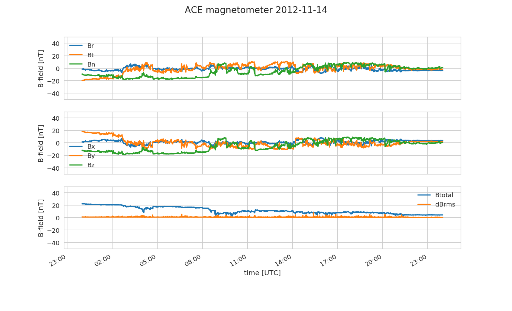

[](https://github.com/space-physics/ace_magnetometer/actions)


[](https://pypi.python.org/pypi/ace_magnetometer)
[](http://pepy.tech/project/ace_magnetometer)


# ACE magnetometer: Load and plot

Load and Plot ACE satelite magnetometer data for Python.



## Examples

Get data from FTP site ftp://mussel.srl.caltech.edu/pub/ace/browse/MAG16sec automatically: ACE magnetometer 16 second cadence by date:

```sh
python DownloadACE.py 2012-02-03 ~/data
```

Load and Plot ACE magnetometer data

```sh
python PlotACE.py 2012-02-03 ~/data
```
